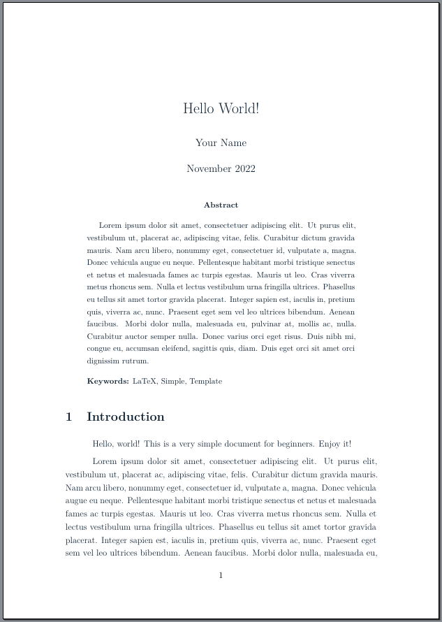
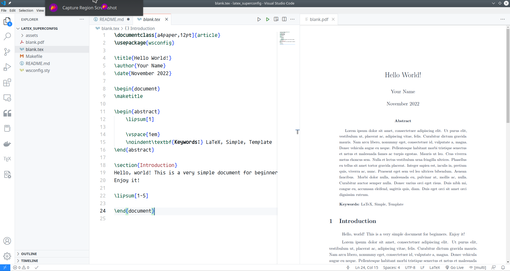

# Latex WSConfig

Hi! The main contribution of this project is a `STY` file which can be included as a package from your main `TEX` file.



## Usage

### Simplest way

Get the file `wsconfig.sty` and place in the same directory your latex file is located. The minimum code to start is this:

```latex
\documentclass{article}
\usepackage{wsconfig}

\begin{document}
Hello World!
\end{document}
```

The customizations (like packages, preamble configurations, etc.) can be done inside the `wsconfig.sty`. 

### Cloning the GitHub repository

The developer use to create content in LaTeX using Visual Studio Code and the extension LaTeX Workshop.

The workflow is:

1. Clone the repo
2. Enter the directory
3. Rename the `blank.tex` file to whathever you need
4. Open the directory in VSCode (`$ code .`)
5. Edit the text file while see the preview in VSCode
6. A lot of files will be created, you can run `make` to remove them



## Document Types

As the developer is a Brazilian student who needs to write both in portuguese and english, this configuration supports the ABNT standard via the abntex2 class. The following classes have been tested:

- article
- memoir
- report
- abntex2

## Packages

This configuration includes some of the most used packages. This is the list:

- afterpage
- amsfonts
- amsmath
- amsthm
- array
- biblatex
- booktabs
- csquotes
- fancybox
- fancyhdr
- fetchcls
- fontenc
- geometry
- graphicx
- hyperref
- ifthen
- indentfirst
- inputenc
- lipsum
- listings
- lmodern
- microtype
- multirow
- nomencl
- pagecolor
- pgfplots
- setspace
- siunitx
- tabularx
- tcolorbox
- tikz
- url
- xcolor

If you have any question, please, leave an issue.
